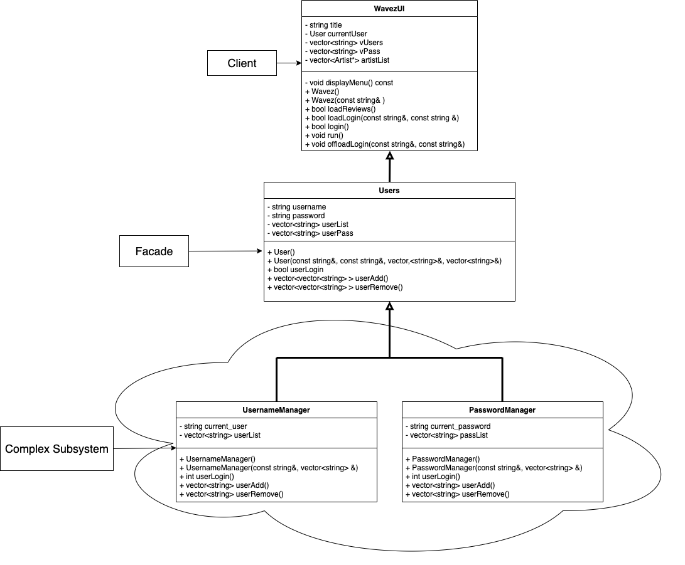

# Wavez

 ## Authors 
 > #### Kobe Braga (https://github.com/kobe-cb), 
 > #### Zergio Ruvalcaba (https://github.com/Zorten), 
 > #### Christopher De Santiago(https://github.com/Chrisdes-99)  
 
## Project Description
  #### Why is it important or interesting to you?
- Everyone likes music, everyone has their own differing opinions about music, and critics are overrated. Wavez is a program where you can either sign up or log in as a registered user and then go and rate music on a 0-5 scale and/or share your own thoughts on it with a review! Other users can then see what you have said, or you can see what they have to say about whatever music they listen to. You can search for artists, albums, or songs with existing ratings and/or reviews, and then you can choose to display all of the ratings/reviews for them. We found this interesting because it’s something that would be fun to make and (as far as we know) there’s not something like it out there. 

#### What languages/tools/technologies do you plan to use? (This list may change over the course of the project)
   - C++
   - Unit Testing
   - Valgrind
   
#### What will be the input/output of your project?
- Input will consist of ratings (on a five star scale) or reviews >* Output will consist of display of such reviews and ratings.

#### What are the three design patterns you will be using.
- Design Pattern 1: Strategy, a behavioral pattern, was chosen due to how we implement our functions. In this case, we can specify a 
“scan()” function that will do a scan based on what object the scan was called on. For example, if we called a scan and it had to do with music reviews, it’ll go to the scan from the reviews and not use the scan from the rating system. In each encapsulated scan(), we’ll impose different algorithms that work best for the objects that it deals with.
- Design Pattern 2: Composite, a structural pattern was chosen because we will have different songs/albums that the user can review. We can treat the song or album as an object that will have more objects in the form of more paths like reviews, song information, etc.  Therefore, Composite helps us manage this hierarchy of objects, and users don’t have to worry about the distinction between these objects. 
- Design Pattern 3: Facade, a structural pattern, was chosen due to how it allows us to hide the complexities of our system to the users. This allows us to give the user a higher-level simple interface that doesn’t overwhelm the user compared to as if we give them access to the subset systems too. Implementation wise, we are considering having a “main menu” where it’ll house all of our operations under simple commands for the user.

## Class Diagram

 Facade Pattern (Kobe): This pattern allows the LoginSystem to utilize both subclasses to operate a single function.
   
 
 
 Strategy Pattern (Zergio): 
  
 
 
 Composite Pattern (Chris):
  
  
 
 > ## Phase III
 > You will need to schedule a check-in with the TA (during lab hours or office hours). Your entire team must be present. 
 > * Before the meeting you should perform a sprint plan like you did in Phase II
 > * In the meeting with your TA you will discuss: 
 >   - How effective your last sprint was (each member should talk about what they did)
 >   - Any tasks that did not get completed last sprint, and how you took them into consideration for this sprint
 >   - Any bugs you've identified and created issues for during the sprint. Do you plan on fixing them in the next sprint or are they lower priority?
 >   - What tasks you are planning for this next sprint.

 > ## Final deliverable
 > All group members will give a demo to the TA during lab time. The TA will check the demo and the project GitHub repository and ask a few questions to all the team members. 
 > Before the demo, you should do the following:
 > * Complete the sections below (i.e. Screenshots, Installation/Usage, Testing)
 > * Plan one more sprint (that you will not necessarily complete before the end of the quarter). Your In-progress and In-testing columns should be empty (you are not doing more work currently) but your TODO column should have a full sprint plan in it as you have done before. This should include any known bugs (there should be some) or new features you would like to add. These should appear as issues/cards on your Kanban board. 
 ## Screenshots
 > Screenshots of the input/output after running your application
 ## Installation/Usage
 > Instructions on installing and running your application
 ## Testing
 > How was your project tested/validated? If you used CI, you should have a "build passing" badge in this README.
 
